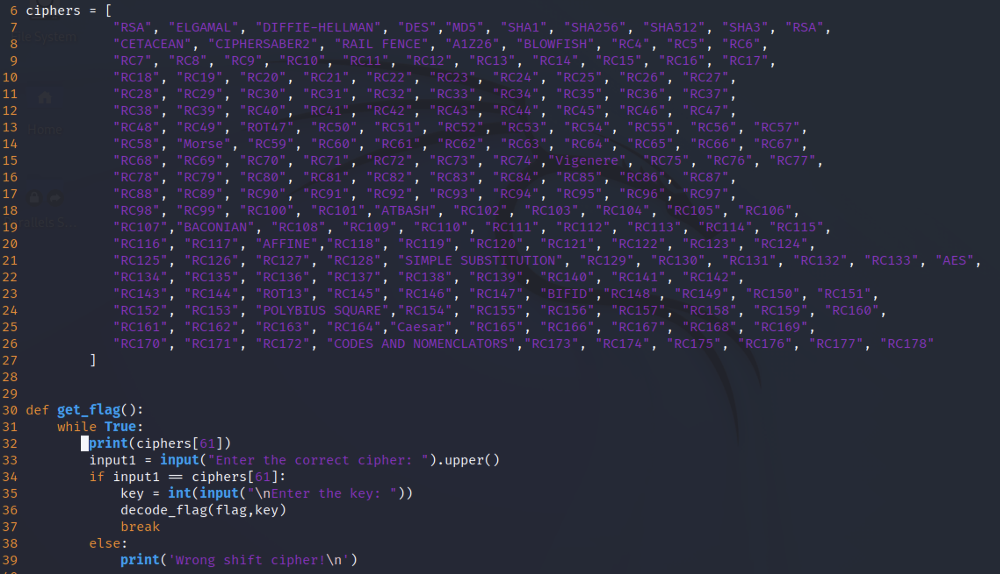
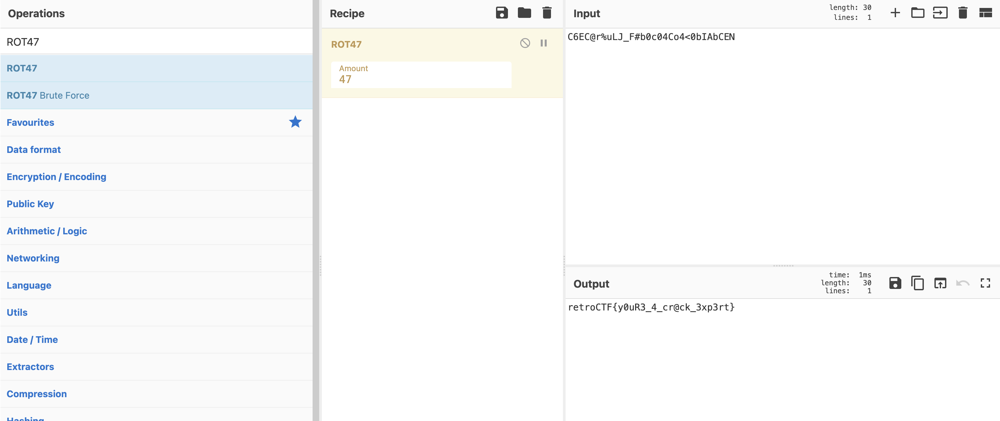

<h1 align=center> Crack Me</h1>

<h2> Description </h2>

Can you figure out the correct cipher being used?

<h2> Hint </h2>

If you look close enough, the cipher is exposed...

<h2> Breakdown </h2>

A file named <b>crackme.zip</b> is given to us.
At first glance, the problem is vague. You can't have a good sense at the problem without further inspection.

<h2> Step 1 </h2>
Unzip the file.  
On linux, you can use the command <b>unzip</b> followed by the file name (i.e., unzip basic_permissions.zip).  
This will extract the contents of the zip file into your current directory.  

<h2> Step 2 </h2>
List the files in your current directory.  
A file named <b>crack.py</b> is provided to us.  
Open the file using a text editor of your choice.  

<h2> Step 3</h2>
Read through the code.
On line 6, a variable named <b>ciphers</b> is a list of types of encryption is given.  
On line 33, the type of encryption is mentioned as such: <b>ciphers[61]</b>.  
<b>ciphers[61]</b> is the array at position 60 in the list.  
Output what type of cipher is being used by using a print statement in the function body: <b> get_flag</b>  
  
Execute the code, and read the output. You'll notice that the output says: <b>ROT47</b>

<h2> Step 4 </h2>
Knowing the cipher is ROT47, we can use a tool like CyberChef to decrypt the flag. 
Copy the encrypted flag (found in the crack.py file) and paste it as input into CyberChef. 
On the left hand side panel, choose <b>ROT47</b>, and drag it into the middle column.
  
There you can see the flag.

