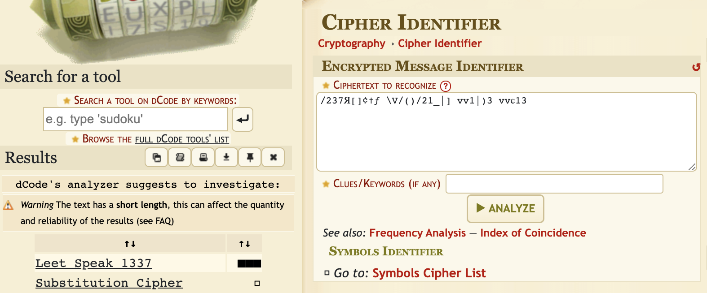
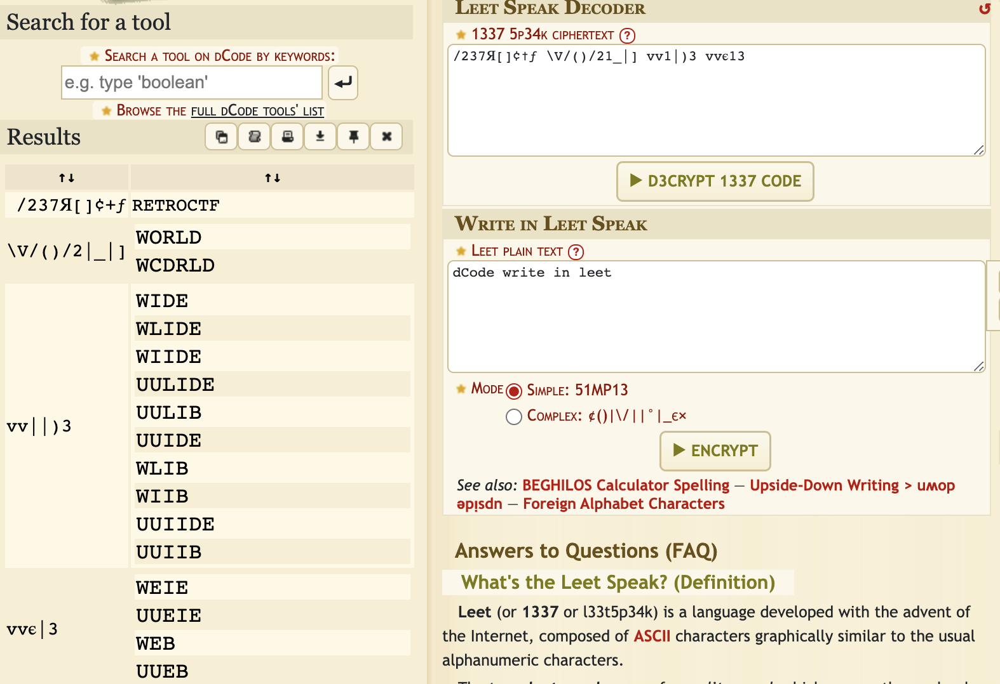

<h1 align=center> 1337 </h1>

<h2> Description </h2>
D3C0D3 7H15 CH4113N63 70 Pr0V3 Y0Ur3 N07 4 N008

/237Я[]¢†ƒ \V/()/21_|] vv1|)3 vvє13

<h2> Hint </h2>
Check out the website dcode and see if you can find an existing tool to decode this!  
Maybe the name of the challenge can help you determine what type of code it is.

<h2> Breakdown </h2>
As this is a cryptography problem and the title is <b>1337</b>. The type of encryption is right in front of us.
The flag is encrypted using <b>1337</b> encoding.

<h2> Step 1 </h2>
To confirm that the encryption is in fact <b>1337</b>, you can use a <b>https://www.dcode.fr/cipher-identifier</b> and copy the flag provided to us in the aforementioned website to detect the cipher.  
  
As you can see on the left handside, the website has determined that the most likely cipher used on the flag is <b>Leet Speak 1337</b>.

<h2> Step 2 </h2>
Use a tool like <b>https://www.dcode.fr/leet-speak-1337</b> which will decrypt a <b>Leet Speak 1337</b> cipher.
  
We get a list a possibilities of the words for the flag. We can assume that the correct options for the flag are the REAL english words.  
We know that the flag formatting is something like <b>retroCTF{...}</b>.  
We can make out the flag as such, <b>retroCTF{World Wide Web}</b>.