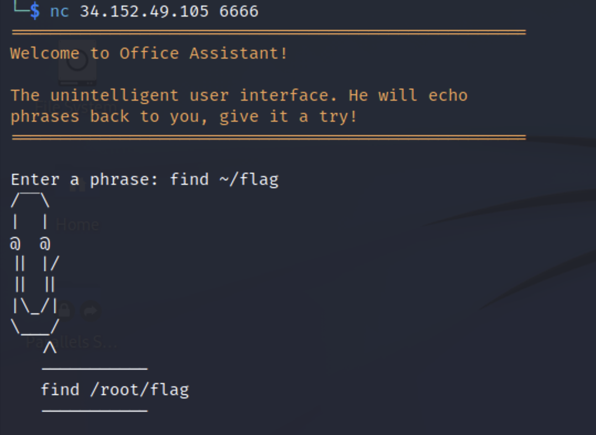
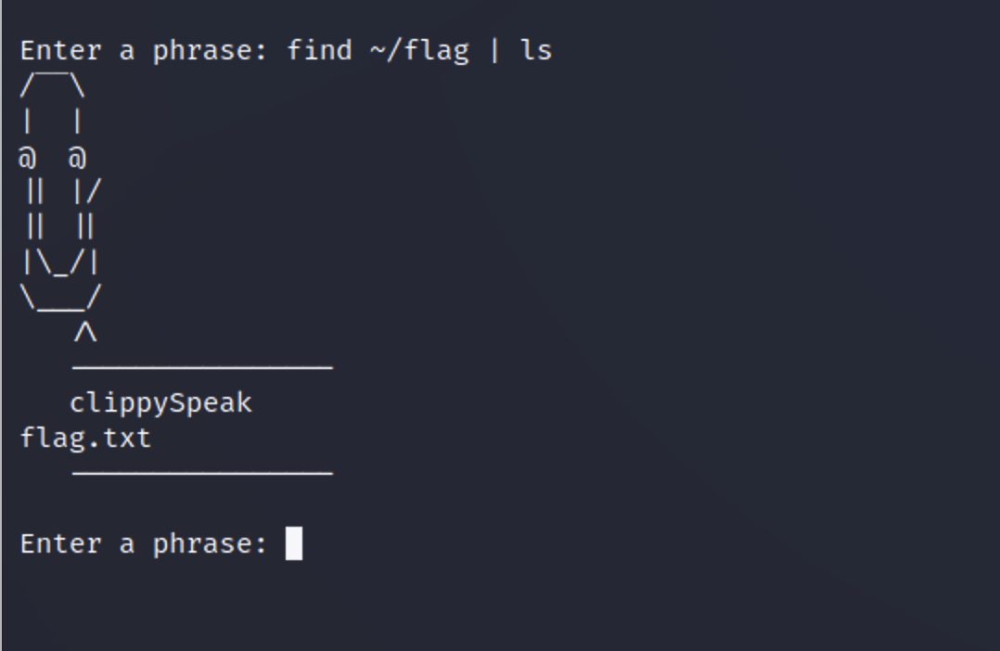
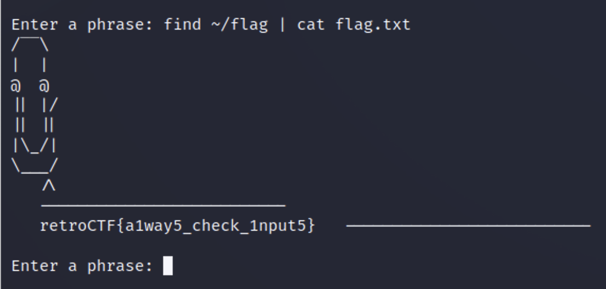

<h1 align=center> Clippy </h1>

<h2> Description </h2>

Clippy parrots what is said to him, can you try to hack it?

<h2> Hint </h2>

None

<h2> Breakdown </h2>

An IP address and a port number is provided to connect with netcat.  

Based on the description, it seems like a reverse shell problem. We have to connect to the target and execute shell commands to find the flag.

<h2> Step 1 </h2>
Connect to the target given the provided IP address and port number via netcat (i.e., nc 'target IP' 'Port Number' or netcat 'target IP' 'Port Number')

<h2> Step 2 </h2>
Execute the shell command <b>find</b> to locate the directory of the flag (i.e., find ~/flag).  
The <b>find</b> command is a utility that recusively descends the directory tree for each path listed.  
This is handy because we don't know the location of the flag.
  

<h2> Step 3 </h2>
Now that we found the location, you can run the same command and pipe it to list the files in the directory.
  

<h2> Step 4 </h2>
We found the <b>flag.txt</b> file, we can use the <b>cat</b> command to display the contents of the file. This will be similar to <b>Step 3</b>. However, we subsitute the <b>ls</b> command with <b>cat</b>.  
  
That's it. Now, you have the flag.