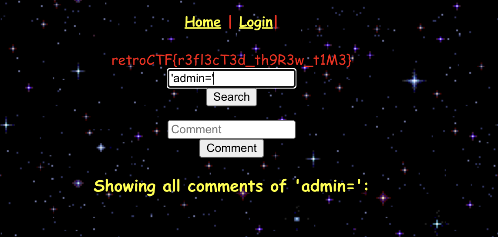

<h1 align=center> Refelected Through Time </h1>

<h2> Description </h2>

The website is still in progress, its fairly new! Leave your feedback on one of the pages.

<h2> Hint </h2>

Don't ALERT the SEARCH team!!!!!!

<h2> Breakdown </h2>

A website is provided for us to exploit. This website has a home page, a search page, and a login page.  
Based on the hint provided it seems like it has something to do with the search page.

<h2> Step 1 </h2>
Click on the provided website link and go to the search page.  

<h2> Step 2 </h2>
You will be prompted with 2 boxes, a search box and a comment box.  
We are looking to use the search box to execute commands.  
This exploit is due to poor webiste configuration.

<h2> Step 3 </h2>
In the search box you can write <b>'admin='</b> and click the search button.
This is the final step to get the flag.  
  
Now you can claim the flag.

